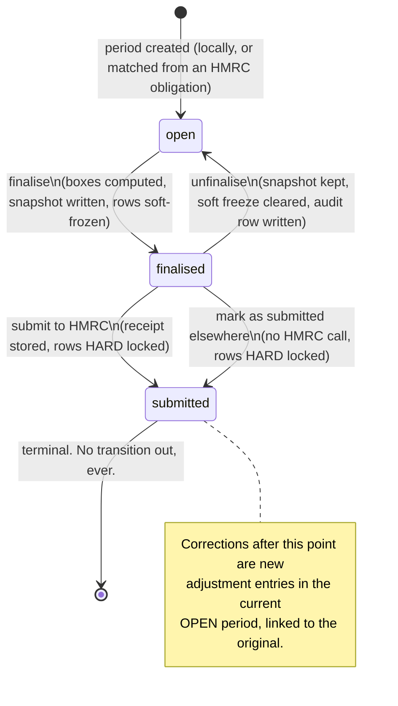
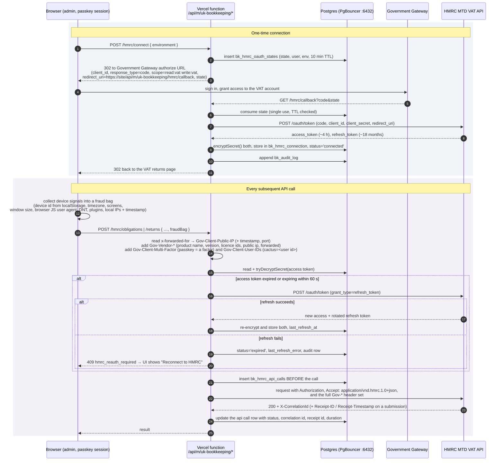

# PLAN - `uk-bookkeeping` module

**Status:** planning only. No implementation code exists yet.
**Date:** 2026-08-20
**Module name:** `uk-bookkeeping` · **Table prefix:** `bk_` (verified free against all 28 installed modules)
**Home:** this file lives in `plans/` alongside `search-module-plan.md` and `space-planner-plan.md`, which is where module plans live in this repo.

---

## 0. Corrections to the brief

The brief was written against an older picture of the platform. These are the places it does not match the codebase, and what this plan does instead. None of them change what we are building, only how.

| Brief said | Reality | This plan |
|---|---|---|
| "Prisma with pooled Postgres (Neon)" | Neon is gone. Self-hosted Postgres 18 on an OVH VPS, PgBouncer in **transaction mode** on `:6432`, Prisma `directUrl` on `:5432` for DDL. `pgbouncer=true` wraps every query in `BEGIN; DEALLOCATE ALL; …; COMMIT` - roughly four network round trips per query | Every aggregate (VAT boxes, reports) is **one** SQL statement. No N+1 anywhere. No session-level advisory locks, no `LISTEN/NOTIFY`, no prepared-statement reuse |
| "Full Prisma schema draft for the module tables" | Modules never get Prisma models. They ship plain SQL migrations and query with `prisma.$queryRaw`. `prisma/schema.prisma` is core-only, and putting module tables there would break the module-isolation rule | §2 is ship-ready SQL plus TypeScript row types. Confirmed with the owner |
| "Money is stored as integer pence" | Shop stores money as `NUMERIC(10,2)` throughout | **`NUMERIC(10,2)`**, per the owner's decision. Exact decimal, not float, so the correctness requirement holds. Arithmetic happens in Postgres (`SUM` over `numeric` is exact); in TypeScript the values arrive as `Prisma.Decimal` and are **never** passed through `Number()`. See §2.6 |
| "Backblaze B2 behind the Cloudflare Worker" | Core media has been multi-provider since the Phase 7a work: B2, R2, S3, Spaces, Wasabi, MinIO, Vercel Blob, Supabase Storage, Cloudinary, ImageKit | Attachments go through core's media abstraction and record `provider` + `key` + `media_id`, exactly as `product-downloads-for-shop` does. Never a hardcoded bucket |
| implied free rein on route duration | Every module API route is served through one core dispatcher, `app/api/m/[module]/[...path]/route.ts`, pinned at `maxDuration = 60`. Module routes **cannot** override it | 60 s is a hard ceiling for submission, obligation fetch, box computation and CSV import. §7 sizes each accordingly |
| nothing said about backup | Any change to module migration SQL trips the backup round-trip gate: `npm run test:backup-roundtrip` must be a **real PASS**. A skip is a FAIL | Every phase that touches `migrations/*.sql` carries that gate in its test strategy |
| nothing said about the admin path | The admin path is per-install configurable (`/cactus-admin`, `/hq`, `/cacti`, …). HMRC requires an exact, pre-registered redirect URI | The OAuth callback is a **fixed public route** outside the admin path: `/api/m/uk-bookkeeping/hmrc/callback`. Same string on every install, so the operator's setup guide can print it verbatim |

Two further constraints discovered in the codebase that materially shape §2:

- **Restore does not disable triggers.** `lib/backup/restore.ts:320` runs `TRUNCATE TABLE … RESTART IDENTITY CASCADE` and then plain `INSERT`s, inside one transaction, with no `session_replication_role = replica` and no `ALTER TABLE … DISABLE TRIGGER`. Row triggers therefore fire on restore. `TRUNCATE` does not fire row triggers, so `UPDATE`/`DELETE` guards are safe, but **any `BEFORE INSERT` guard must be written so that a legitimately restored row passes it.** This is the single biggest trap in the design and §2.4 addresses it head-on.
- **Restore ordering.** The restore inserts table by table, so a self-referencing FK (`corrects_transaction_id`) or a forward FK (`locked_period_id`) can be violated mid-restore. Every such FK is declared `DEFERRABLE INITIALLY DEFERRED` so it is checked at `COMMIT`, by which time everything is present.

---

## 1. Architecture overview

`uk-bookkeeping` is a standalone module. It requires no other module, contributes no Puck blocks, and owns no public URL segment. Everything it does happens behind the admin.

**Four layers, cleanly separated:**

1. **Records.** `bk_transactions` + `bk_transaction_lines` + `bk_attachments` + `bk_categories`. A transaction is a header (date, counterparty, direction) with one or more lines (category, net, VAT rate, VAT amount, VAT treatment). Lines exist so a single receipt can split across categories and VAT rates, which is ordinary and unavoidable (a fuel receipt with a sandwich on it).

2. **Computation.** A pure SQL layer that turns records into the nine VAT boxes for a date range under a named scheme. It is a function of `(period start, period end, scheme, treatment map)` and nothing else. No box value is ever typed by a human, at any point, in any code path. This is the MTD digital-links requirement and it is the reason the module exists in this shape.

3. **Periods.** `bk_vat_periods` with a three-state lifecycle, a frozen snapshot of the boxes and of the exact rows that produced them, and a hard database lock on those rows once submitted.

4. **HMRC.** An OAuth client, a token store, a fraud-header collector and a thin API client, all behind one interface. Absent or unconfigured, layers 1 to 3 work in full.

**The HMRC seam.** All outward traffic goes through a single interface, `HmrcClient`, defined in `lib/hmrc/client.ts`:

```ts
export interface HmrcClient {
  authorizationUrl(input: { state: string; environment: HmrcEnvironment }): string
  exchangeCode(input: { code: string; environment: HmrcEnvironment }): Promise<HmrcTokens>
  refresh(input: { refreshToken: string; environment: HmrcEnvironment }): Promise<HmrcTokens>
  obligations(input: ObligationsQuery, ctx: HmrcCallContext): Promise<VatObligation[]>
  submitReturn(input: VatReturnPayload, ctx: HmrcCallContext): Promise<VatSubmissionReceipt>
  viewReturn(input: { vrn: string; periodKey: string }, ctx: HmrcCallContext): Promise<VatReturnView>
  liabilities(input: DateRangeQuery, ctx: HmrcCallContext): Promise<VatLiability[]>
  payments(input: DateRangeQuery, ctx: HmrcCallContext): Promise<VatPayment[]>
}
```

`HmrcCallContext` carries the access token and an opaque `fraudHeaders: Record<string, string>` bag. v1 ships one implementation, `DirectHmrcClient`, which reads `HMRC_CLIENT_ID` / `HMRC_CLIENT_SECRET` from the instance's own environment and talks straight to HMRC. A future hosted `BrokerHmrcClient` would post the same payload plus the same fraud bag to a Cactus-operated broker holding one set of production credentials and, crucially, a **stable egress IP** (which Vercel serverless does not have - see §9, Q3). Because the fraud headers are gathered client-side and threaded through as an opaque bag, and because tokens are only ever handled inside the client implementation, swapping the two touches nothing in layers 1 to 3. That is the whole point of the seam.

**Degradation.** With no `HMRC_CLIENT_ID`, the VAT returns page still lists periods, still computes and displays all nine boxes, and still offers "Finalise" and "Mark as submitted elsewhere". Only the "Submit to HMRC" button is replaced, by a link to the operator setup guide. An operator who never gets production approval still has a usable, complete VAT workbook.

---

## 2. Database

### 2.1 How it ships

Plain SQL under `modules/uk-bookkeeping/migrations/`, applied by `scripts/run-module-migrations.mjs` during the **Vercel build step only**, in lexicographic order, recorded per file in the core `ModuleMigration` table with a checksum. Never applied at runtime; Vercel's filesystem is read only.

- `001_initial.sql` - tables, indexes, constraints, seed categories.
- `002_immutability.sql` - trigger functions and triggers. Split from 001 deliberately so the guard can be re-read, reviewed and reasoned about as one file, and so a future correction to a guard is a clean new numbered file rather than a diff buried in a 400-line schema.

Both are fully idempotent (`CREATE TABLE IF NOT EXISTS`, `CREATE OR REPLACE FUNCTION`, `DROP TRIGGER IF EXISTS` then `CREATE TRIGGER`) so they are correct for fresh installs and harmless to re-run. Later schema changes are new numbered files; **001 and 002 are never edited after release** (the checksum in `ModuleMigration` detects tampering, and editing in place only ever reaches fresh installs - it broke the live Deskwell site once already).

Triggers need no special handling in this flow. There is precedent: `modules/shop-variations/migrations/007_delete_children_with_parent.sql` ships a `plpgsql` function and an `AFTER DELETE` trigger through exactly this path. The only thing that differs from ordinary DDL is that `prisma migrate deploy` never sees it, which is fine because the module runner is a separate step that runs after it.

### 2.2 Tables

```sql
-- ===========================================================================
-- 001_initial.sql
-- ===========================================================================

-- --- Chart of categories -----------------------------------------------------
-- Seeded with a small UK set (see 2.5) and extensible by the owner. `code` is
-- the stable identity; `name` is what the owner sees and may rename freely.
CREATE TABLE IF NOT EXISTS "bk_categories" (
  "id"              TEXT NOT NULL DEFAULT gen_random_uuid()::text,
  "code"            TEXT NOT NULL,
  "name"            TEXT NOT NULL,
  "direction"       TEXT NOT NULL,          -- 'income' | 'expense' | 'both'
  -- Reporting groupings. Deliberately plain text, not enums: HMRC renumbers
  -- self-assessment boxes and we are not shipping a migration when they do.
  "sa103_box"       TEXT,                   -- e.g. 'SA103F.17'
  "ct600_group"     TEXT,                   -- e.g. 'cost-of-sales'
  -- Whether this category belongs in a profit and loss account at all. Drawings,
  -- dividends, capital introduced and VAT payments to HMRC do not, but they are
  -- still transactions the owner records.
  "is_trading"      BOOLEAN NOT NULL DEFAULT TRUE,
  -- Default for the line's `is_capital` flag. Capital purchases stay out of P&L
  -- but their VAT is still reclaimable and their net value still lands in box 7.
  "is_capital"      BOOLEAN NOT NULL DEFAULT FALSE,
  "position"        INTEGER NOT NULL DEFAULT 0,
  "archived"        BOOLEAN NOT NULL DEFAULT FALSE,
  -- Seeded rows cannot be deleted, only archived, because historic transactions
  -- point at them and a 2019 return must still explain itself in 2026.
  "is_system"       BOOLEAN NOT NULL DEFAULT FALSE,
  "created_at"      TIMESTAMPTZ NOT NULL DEFAULT NOW(),
  "updated_at"      TIMESTAMPTZ NOT NULL DEFAULT NOW(),
  CONSTRAINT "bk_categories_pkey" PRIMARY KEY ("id"),
  CONSTRAINT "bk_categories_code_key" UNIQUE ("code"),
  CONSTRAINT "bk_categories_direction_chk"
    CHECK ("direction" IN ('income', 'expense', 'both'))
);

-- --- VAT periods -------------------------------------------------------------
-- A period may be created locally (from the scheme setting) before HMRC is ever
-- connected, then matched to a real obligation by date range once it is. Never
-- assume quarters: `start_date`/`end_date` come from the obligation when we have
-- one, and monthly, quarterly and annual all fall out of the same two columns.
CREATE TABLE IF NOT EXISTS "bk_vat_periods" (
  "id"                        TEXT NOT NULL DEFAULT gen_random_uuid()::text,
  -- HMRC's own key for the obligation. NULL until matched. Note it can contain
  -- characters that must be percent-encoded when it goes in a URL path (see 5.4).
  "period_key"                TEXT,
  "start_date"                DATE NOT NULL,
  "end_date"                  DATE NOT NULL,
  "due_date"                  DATE,
  "status"                    TEXT NOT NULL DEFAULT 'open',   -- open | finalised | submitted
  -- The scheme AS IT WAS when this period was worked. Never read the current
  -- setting to recompute a historic period: switching accrual to cash must not
  -- silently restate a return that was filed two years ago.
  "scheme"                    TEXT NOT NULL,                   -- accrual | cash
  "source"                    TEXT NOT NULL DEFAULT 'local',   -- local | hmrc
  "obligation_status"         TEXT,                            -- O | F, as returned
  "vrn"                       TEXT,
  "finalised_at"              TIMESTAMPTZ,
  "finalised_by_user_id"      TEXT,
  "submitted_at"              TIMESTAMPTZ,
  "submitted_by_user_id"      TEXT,
  -- TRUE when the owner filed through some other tool and is recording the fact
  -- here so the rows lock. Keeps the module honest for anyone who never gets
  -- production approval from HMRC.
  "submitted_externally"      BOOLEAN NOT NULL DEFAULT FALSE,
  "hmrc_processing_date"      TIMESTAMPTZ,
  "hmrc_form_bundle_number"   TEXT,
  "hmrc_charge_ref_number"    TEXT,
  "hmrc_payment_indicator"    TEXT,
  "hmrc_receipt_id"           TEXT,
  "hmrc_receipt_timestamp"    TEXT,
  "hmrc_correlation_id"       TEXT,
  "created_at"                TIMESTAMPTZ NOT NULL DEFAULT NOW(),
  "updated_at"                TIMESTAMPTZ NOT NULL DEFAULT NOW(),
  CONSTRAINT "bk_vat_periods_pkey" PRIMARY KEY ("id"),
  CONSTRAINT "bk_vat_periods_status_chk"
    CHECK ("status" IN ('open', 'finalised', 'submitted')),
  CONSTRAINT "bk_vat_periods_scheme_chk"
    CHECK ("scheme" IN ('accrual', 'cash')),
  CONSTRAINT "bk_vat_periods_dates_chk" CHECK ("end_date" >= "start_date"),
  CONSTRAINT "bk_vat_periods_range_key" UNIQUE ("start_date", "end_date")
);
CREATE UNIQUE INDEX IF NOT EXISTS "bk_vat_periods_period_key_key"
  ON "bk_vat_periods" ("period_key") WHERE "period_key" IS NOT NULL;

-- --- Transactions ------------------------------------------------------------
CREATE TABLE IF NOT EXISTS "bk_transactions" (
  "id"                    TEXT NOT NULL DEFAULT gen_random_uuid()::text,
  "entry_type"            TEXT NOT NULL DEFAULT 'normal',  -- normal | adjustment | opening_balance
  "direction"             TEXT NOT NULL,                    -- income | expense
  -- The tax point: invoice date, or date of supply. Drives box allocation under
  -- the accrual scheme.
  "tax_point_date"        DATE NOT NULL,
  -- When the money actually moved. Drives box allocation under cash accounting.
  -- NULL means unpaid, which under cash accounting means it is in no period yet.
  "settled_date"          DATE,
  "counterparty"          TEXT NOT NULL,
  "description"           TEXT NOT NULL DEFAULT '',
  "reference"             TEXT,              -- their invoice / receipt number
  -- Draft is for CSV import review (phase 7). Only 'posted' rows ever reach a
  -- VAT box. A draft can be edited and deleted freely; it is not a record yet.
  "status"                TEXT NOT NULL DEFAULT 'posted',   -- draft | posted
  "source"                TEXT NOT NULL DEFAULT 'manual',   -- manual | import | api
  "source_ref"            TEXT,
  -- Corrections. An adjustment points at the locked row it puts right and lands
  -- in the current open period, never in the locked one.
  "corrects_transaction_id" TEXT,
  "correction_reason"     TEXT,
  -- Soft freeze, set on finalise, cleared on unfinalise. Application-enforced.
  "finalised_period_id"   TEXT,
  -- HARD lock, set on submit, NEVER cleared by anything. Enforced by trigger.
  "locked_period_id"      TEXT,
  "locked_at"             TIMESTAMPTZ,
  "created_by_user_id"    TEXT,
  "updated_by_user_id"    TEXT,
  "created_at"            TIMESTAMPTZ NOT NULL DEFAULT NOW(),
  "updated_at"            TIMESTAMPTZ NOT NULL DEFAULT NOW(),
  CONSTRAINT "bk_transactions_pkey" PRIMARY KEY ("id"),
  CONSTRAINT "bk_transactions_direction_chk"
    CHECK ("direction" IN ('income', 'expense')),
  CONSTRAINT "bk_transactions_entry_type_chk"
    CHECK ("entry_type" IN ('normal', 'adjustment', 'opening_balance')),
  CONSTRAINT "bk_transactions_status_chk"
    CHECK ("status" IN ('draft', 'posted')),
  -- An adjustment must say what it corrects and why. A normal entry must not.
  CONSTRAINT "bk_transactions_adjustment_chk" CHECK (
    ("entry_type" = 'adjustment' AND "corrects_transaction_id" IS NOT NULL)
    OR ("entry_type" <> 'adjustment' AND "corrects_transaction_id" IS NULL)
  ),
  -- DEFERRABLE: a backup restore inserts rows table by table and row by row, so
  -- a self-reference or a forward reference is routinely unsatisfied halfway
  -- through. Deferring to COMMIT makes insert order irrelevant.
  CONSTRAINT "bk_transactions_corrects_fkey"
    FOREIGN KEY ("corrects_transaction_id") REFERENCES "bk_transactions"("id")
    ON DELETE RESTRICT DEFERRABLE INITIALLY DEFERRED,
  CONSTRAINT "bk_transactions_locked_period_fkey"
    FOREIGN KEY ("locked_period_id") REFERENCES "bk_vat_periods"("id")
    ON DELETE RESTRICT DEFERRABLE INITIALLY DEFERRED,
  CONSTRAINT "bk_transactions_finalised_period_fkey"
    FOREIGN KEY ("finalised_period_id") REFERENCES "bk_vat_periods"("id")
    ON DELETE SET NULL DEFERRABLE INITIALLY DEFERRED
);
CREATE INDEX IF NOT EXISTS "bk_transactions_tax_point_idx"
  ON "bk_transactions" ("tax_point_date");
CREATE INDEX IF NOT EXISTS "bk_transactions_settled_idx"
  ON "bk_transactions" ("settled_date");
CREATE INDEX IF NOT EXISTS "bk_transactions_locked_idx"
  ON "bk_transactions" ("locked_period_id");
CREATE INDEX IF NOT EXISTS "bk_transactions_counterparty_idx"
  ON "bk_transactions" (lower("counterparty"));

-- --- Transaction lines -------------------------------------------------------
CREATE TABLE IF NOT EXISTS "bk_transaction_lines" (
  "id"                TEXT NOT NULL DEFAULT gen_random_uuid()::text,
  "transaction_id"    TEXT NOT NULL,
  "position"          INTEGER NOT NULL DEFAULT 0,
  "category_id"       TEXT NOT NULL,
  "description"       TEXT NOT NULL DEFAULT '',
  -- How this line behaves for VAT purposes. This is what makes boxes 2, 8 and 9
  -- formula-driven rather than typed, and what leaves the door open for reverse
  -- charge and postponed import VAT without a schema change later.
  "vat_treatment"     TEXT NOT NULL DEFAULT 'domestic',
  -- The rate BAND, and the rate actually applied, stored. If the standard rate
  -- ever moves off 20%, every historic return still recomputes to what was filed.
  "vat_rate_code"     TEXT NOT NULL,        -- standard | reduced | zero | exempt | outside_scope
  "vat_rate_percent"  NUMERIC(5,2) NOT NULL DEFAULT 0,
  "net_amount"        NUMERIC(10,2) NOT NULL,
  -- Editable, so it can be made to match the source document penny for penny
  -- rather than a recomputation that disagrees with the supplier's rounding.
  "vat_amount"        NUMERIC(10,2) NOT NULL DEFAULT 0,
  "gross_amount"      NUMERIC(10,2) NOT NULL,
  "is_capital"        BOOLEAN NOT NULL DEFAULT FALSE,
  -- Denormalised copy of the parent's hard lock. Present so the guard trigger on
  -- this table never has to read the parent, which is what keeps it restore-safe.
  "locked_period_id"  TEXT,
  "created_at"        TIMESTAMPTZ NOT NULL DEFAULT NOW(),
  "updated_at"        TIMESTAMPTZ NOT NULL DEFAULT NOW(),
  CONSTRAINT "bk_transaction_lines_pkey" PRIMARY KEY ("id"),
  CONSTRAINT "bk_transaction_lines_transaction_fkey"
    FOREIGN KEY ("transaction_id") REFERENCES "bk_transactions"("id")
    ON DELETE CASCADE DEFERRABLE INITIALLY DEFERRED,
  CONSTRAINT "bk_transaction_lines_category_fkey"
    FOREIGN KEY ("category_id") REFERENCES "bk_categories"("id")
    ON DELETE RESTRICT DEFERRABLE INITIALLY DEFERRED,
  CONSTRAINT "bk_transaction_lines_rate_code_chk" CHECK ("vat_rate_code" IN
    ('standard', 'reduced', 'zero', 'exempt', 'outside_scope')),
  CONSTRAINT "bk_transaction_lines_treatment_chk" CHECK ("vat_treatment" IN
    ('domestic', 'ni_eu_acquisition', 'ni_eu_dispatch',
     'reverse_charge_services', 'import_pva', 'domestic_reverse_charge',
     'outside_scope')),
  -- The one arithmetic invariant worth spending a constraint on. Exact because
  -- these are NUMERIC, not floats.
  CONSTRAINT "bk_transaction_lines_gross_chk"
    CHECK ("gross_amount" = "net_amount" + "vat_amount")
);
CREATE INDEX IF NOT EXISTS "bk_transaction_lines_transaction_idx"
  ON "bk_transaction_lines" ("transaction_id");
CREATE INDEX IF NOT EXISTS "bk_transaction_lines_category_idx"
  ON "bk_transaction_lines" ("category_id");

-- --- Attachments -------------------------------------------------------------
-- Evidence. HMRC expects records kept six years, so these blobs are never
-- garbage-collected: the module registers a core.media-usage-providers
-- extension so the library reports them as in use, AND keeps its own
-- provider/key so a download works even if the library row is deleted.
CREATE TABLE IF NOT EXISTS "bk_attachments" (
  "id"                  TEXT NOT NULL DEFAULT gen_random_uuid()::text,
  "transaction_id"      TEXT NOT NULL,
  "name"                TEXT NOT NULL,        -- plain English label
  "filename"            TEXT NOT NULL,        -- as uploaded
  "url"                 TEXT NOT NULL,
  "media_provider"      TEXT,
  "media_key"           TEXT,
  "media_id"            TEXT,
  "mime_type"           TEXT NOT NULL,
  "size"                INTEGER NOT NULL DEFAULT 0,
  -- Content hash of the bytes as stored. Cheap, and it is what lets the module
  -- say "this is the same file you attached in 2026" six years later.
  "sha256"              TEXT,
  "position"            INTEGER NOT NULL DEFAULT 0,
  "locked_period_id"    TEXT,
  "uploaded_by_user_id" TEXT,
  "created_at"          TIMESTAMPTZ NOT NULL DEFAULT NOW(),
  CONSTRAINT "bk_attachments_pkey" PRIMARY KEY ("id"),
  CONSTRAINT "bk_attachments_transaction_fkey"
    FOREIGN KEY ("transaction_id") REFERENCES "bk_transactions"("id")
    ON DELETE CASCADE DEFERRABLE INITIALLY DEFERRED
);
CREATE INDEX IF NOT EXISTS "bk_attachments_transaction_idx"
  ON "bk_attachments" ("transaction_id");

-- --- Period snapshots --------------------------------------------------------
-- The frozen record of what was filed. `boxes` holds the nine values exactly as
-- sent, as STRINGS, so no JSON number ever gets near them.
CREATE TABLE IF NOT EXISTS "bk_period_snapshots" (
  "id"              TEXT NOT NULL DEFAULT gen_random_uuid()::text,
  "period_id"       TEXT NOT NULL,
  "kind"            TEXT NOT NULL,      -- finalised | submitted
  "scheme"          TEXT NOT NULL,
  "boxes"           JSONB NOT NULL,     -- the 9 values, as sent, as strings
  "boxes_unrounded" JSONB NOT NULL,     -- boxes 6-9 before whole-pound rounding
  "vrn"             TEXT,
  "created_at"      TIMESTAMPTZ NOT NULL DEFAULT NOW(),
  "created_by_user_id" TEXT,
  -- Tamper-evidence chain. Computed in application code, NOT in a trigger, so a
  -- restore reinserts the stored hashes verbatim rather than recomputing them.
  "chain_index"     BIGINT NOT NULL,
  "prev_hash"       TEXT,
  "row_hash"        TEXT NOT NULL,
  CONSTRAINT "bk_period_snapshots_pkey" PRIMARY KEY ("id"),
  CONSTRAINT "bk_period_snapshots_period_fkey"
    FOREIGN KEY ("period_id") REFERENCES "bk_vat_periods"("id")
    ON DELETE RESTRICT DEFERRABLE INITIALLY DEFERRED,
  CONSTRAINT "bk_period_snapshots_kind_chk" CHECK ("kind" IN ('finalised', 'submitted'))
);
CREATE UNIQUE INDEX IF NOT EXISTS "bk_period_snapshots_chain_key"
  ON "bk_period_snapshots" ("chain_index");

-- Exactly which rows, at exactly which values, produced those boxes. This is the
-- digital-link audit trail: given a snapshot you can reconstruct the arithmetic
-- without trusting the live tables at all.
CREATE TABLE IF NOT EXISTS "bk_period_snapshot_lines" (
  "id"              TEXT NOT NULL DEFAULT gen_random_uuid()::text,
  "snapshot_id"     TEXT NOT NULL,
  "transaction_id"  TEXT NOT NULL,
  "line_id"         TEXT NOT NULL,
  "direction"       TEXT NOT NULL,
  "vat_treatment"   TEXT NOT NULL,
  "vat_rate_code"   TEXT NOT NULL,
  "net_amount"      NUMERIC(10,2) NOT NULL,
  "vat_amount"      NUMERIC(10,2) NOT NULL,
  -- Which boxes this line landed in, e.g. ["1","6"]. Written by the same query
  -- that computed the totals, so the explanation cannot drift from the answer.
  "boxes"           JSONB NOT NULL,
  CONSTRAINT "bk_period_snapshot_lines_pkey" PRIMARY KEY ("id"),
  CONSTRAINT "bk_period_snapshot_lines_snapshot_fkey"
    FOREIGN KEY ("snapshot_id") REFERENCES "bk_period_snapshots"("id")
    ON DELETE CASCADE DEFERRABLE INITIALLY DEFERRED
);
CREATE INDEX IF NOT EXISTS "bk_period_snapshot_lines_snapshot_idx"
  ON "bk_period_snapshot_lines" ("snapshot_id");

-- --- Audit log ---------------------------------------------------------------
-- Append only. Hash-chained in application code (see 4.4).
CREATE TABLE IF NOT EXISTS "bk_audit_log" (
  "id"              TEXT NOT NULL DEFAULT gen_random_uuid()::text,
  "at"              TIMESTAMPTZ NOT NULL DEFAULT NOW(),
  "actor_user_id"   TEXT,
  "actor_email"     TEXT,
  "action"          TEXT NOT NULL,
  "entity_type"     TEXT NOT NULL,
  "entity_id"       TEXT,
  "summary"         TEXT NOT NULL,
  "detail"          JSONB,
  "ip_truncated"    TEXT,
  "chain_index"     BIGINT NOT NULL,
  "prev_hash"       TEXT,
  "row_hash"        TEXT NOT NULL,
  CONSTRAINT "bk_audit_log_pkey" PRIMARY KEY ("id")
);
CREATE UNIQUE INDEX IF NOT EXISTS "bk_audit_log_chain_key"
  ON "bk_audit_log" ("chain_index");
CREATE INDEX IF NOT EXISTS "bk_audit_log_entity_idx"
  ON "bk_audit_log" ("entity_type", "entity_id");

-- --- Settings ----------------------------------------------------------------
CREATE TABLE IF NOT EXISTS "bk_settings" (
  "id"                      TEXT NOT NULL DEFAULT 'singleton',
  "business_name"           TEXT,
  "business_type"           TEXT NOT NULL DEFAULT 'ltd',   -- ltd | sole_trader
  "vrn"                     TEXT,
  "vat_registered_from"     DATE,
  "scheme"                  TEXT NOT NULL DEFAULT 'accrual',
  "scheme_changed_at"       TIMESTAMPTZ,
  "period_frequency"        TEXT NOT NULL DEFAULT 'quarterly', -- monthly|quarterly|annual
  "first_period_start"      DATE,
  "hmrc_environment"        TEXT NOT NULL DEFAULT 'sandbox',
  -- Error correction threshold, configurable so an HMRC rule change is a setting
  -- edit and not a code release. Defaults documented in 9, Q1.
  "error_threshold_fixed"   NUMERIC(12,2) NOT NULL DEFAULT 10000.00,
  "error_threshold_percent" NUMERIC(5,2)  NOT NULL DEFAULT 1.00,
  "error_threshold_cap"     NUMERIC(12,2) NOT NULL DEFAULT 50000.00,
  "attachment_max_bytes"    INTEGER NOT NULL DEFAULT 15728640,  -- 15 MB
  "retention_years"         INTEGER NOT NULL DEFAULT 6,
  "created_at"              TIMESTAMPTZ NOT NULL DEFAULT NOW(),
  "updated_at"              TIMESTAMPTZ NOT NULL DEFAULT NOW(),
  CONSTRAINT "bk_settings_pkey" PRIMARY KEY ("id"),
  CONSTRAINT "bk_settings_singleton_chk" CHECK ("id" = 'singleton'),
  CONSTRAINT "bk_settings_scheme_chk" CHECK ("scheme" IN ('accrual', 'cash')),
  CONSTRAINT "bk_settings_env_chk" CHECK ("hmrc_environment" IN ('sandbox', 'production')),
  CONSTRAINT "bk_settings_freq_chk"
    CHECK ("period_frequency" IN ('monthly', 'quarterly', 'annual'))
);

-- --- HMRC connection ---------------------------------------------------------
-- One VRN per instance in v1. Tokens are encrypted at rest with core's
-- lib/crypto/secrets.ts (AES-256-GCM under the per-install ENCRYPTION_KEY).
-- A restored backup carries ciphertext written under a DIFFERENT key, so reads
-- use tryDecryptSecret and a null means "reconnect", not "error".
CREATE TABLE IF NOT EXISTS "bk_hmrc_connection" (
  "id"                        TEXT NOT NULL DEFAULT 'singleton',
  "vrn"                       TEXT,
  "environment"               TEXT NOT NULL DEFAULT 'sandbox',
  "status"                    TEXT NOT NULL DEFAULT 'never',  -- never|connected|expired|revoked
  "access_token_encrypted"    TEXT,
  "access_token_expires_at"   TIMESTAMPTZ,
  "refresh_token_encrypted"   TEXT,
  "refresh_token_expires_at"  TIMESTAMPTZ,
  "scope"                     TEXT,
  "connected_at"              TIMESTAMPTZ,
  "connected_by_user_id"      TEXT,
  "last_refresh_at"           TIMESTAMPTZ,
  "last_refresh_error"        TEXT,
  "updated_at"                TIMESTAMPTZ NOT NULL DEFAULT NOW(),
  CONSTRAINT "bk_hmrc_connection_pkey" PRIMARY KEY ("id"),
  CONSTRAINT "bk_hmrc_connection_singleton_chk" CHECK ("id" = 'singleton')
);

-- Short-lived CSRF state for the authorisation redirect.
CREATE TABLE IF NOT EXISTS "bk_hmrc_oauth_states" (
  "state"        TEXT NOT NULL,
  "user_id"      TEXT NOT NULL,
  "environment"  TEXT NOT NULL,
  "return_to"    TEXT,
  "created_at"   TIMESTAMPTZ NOT NULL DEFAULT NOW(),
  "expires_at"   TIMESTAMPTZ NOT NULL,
  CONSTRAINT "bk_hmrc_oauth_states_pkey" PRIMARY KEY ("state")
);

-- --- API call log ------------------------------------------------------------
-- Every outbound HMRC call. This is not decoration: production approval requires
-- evidence that fraud prevention headers were sent correctly, and this table IS
-- that evidence. Headers are stored as sent, with the Authorization header and
-- any token never written.
CREATE TABLE IF NOT EXISTS "bk_hmrc_api_calls" (
  "id"                TEXT NOT NULL DEFAULT gen_random_uuid()::text,
  "at"                TIMESTAMPTZ NOT NULL DEFAULT NOW(),
  "environment"       TEXT NOT NULL,
  "method"            TEXT NOT NULL,
  "path"              TEXT NOT NULL,
  "status_code"       INTEGER,
  "duration_ms"       INTEGER,
  "correlation_id"    TEXT,
  "receipt_id"        TEXT,
  "fraud_headers"     JSONB,
  "error_code"        TEXT,
  "error_body"        JSONB,
  "actor_user_id"     TEXT,
  CONSTRAINT "bk_hmrc_api_calls_pkey" PRIMARY KEY ("id")
);
CREATE INDEX IF NOT EXISTS "bk_hmrc_api_calls_at_idx" ON "bk_hmrc_api_calls" ("at");
```

**Deliberately no Postgres `ENUM` types anywhere.** Text plus a `CHECK` constraint instead. Three reasons: adding a value to an enum is a `ALTER TYPE` that cannot run inside a transaction on older servers; the module `teardown` list names tables, not types, so an uninstall would strand orphan types; and the backup serialiser has to quote enum type names specially (`::"NotificationChannel"[]`), which is one more thing to get wrong for no benefit here.

**Column types are all in the backup serialiser's supported set** (`lib/backup/serialize.ts`): `text`, `int4`, `int8`, `numeric`, `bool`, `date`, `timestamptz`, `jsonb`. `lib/backup/schema-coverage.test.ts` parses these migration files statically and will assert this on the PR that adds them, which is exactly the backstop we want.

### 2.3 TypeScript row types

Modules query with `prisma.$queryRaw` and get plain rows back, so the types are hand-written in `lib/types.ts`. The important discipline is the money columns.

```ts
import type { Prisma } from '@prisma/client'

/**
 * NUMERIC(10,2) comes back from prisma.$queryRaw as Prisma.Decimal.
 * NEVER Number() one of these. Never JSON.stringify one and hope.
 * Arithmetic belongs in SQL; where it must happen in TS, use Decimal methods
 * and .toFixed(2) at the very edge, once, on the way to the screen or to HMRC.
 */
export type Money = Prisma.Decimal

export type VatRateCode = 'standard' | 'reduced' | 'zero' | 'exempt' | 'outside_scope'

export type VatTreatment =
  | 'domestic'
  | 'ni_eu_acquisition'        // goods into NI from an EU member state
  | 'ni_eu_dispatch'           // goods from NI to an EU member state
  | 'reverse_charge_services'  // services bought from overseas
  | 'import_pva'               // postponed VAT accounting on imports
  | 'domestic_reverse_charge'  // e.g. construction services
  | 'outside_scope'

export type BkTransactionRow = {
  id: string
  entry_type: 'normal' | 'adjustment' | 'opening_balance'
  direction: 'income' | 'expense'
  tax_point_date: Date
  settled_date: Date | null
  counterparty: string
  description: string
  reference: string | null
  status: 'draft' | 'posted'
  source: string
  source_ref: string | null
  corrects_transaction_id: string | null
  correction_reason: string | null
  finalised_period_id: string | null
  locked_period_id: string | null
  locked_at: Date | null
  created_by_user_id: string | null
  updated_by_user_id: string | null
  created_at: Date
  updated_at: Date
}

export type BkTransactionLineRow = {
  id: string
  transaction_id: string
  position: number
  category_id: string
  description: string
  vat_treatment: VatTreatment
  vat_rate_code: VatRateCode
  vat_rate_percent: Money
  net_amount: Money
  vat_amount: Money
  gross_amount: Money
  is_capital: boolean
  locked_period_id: string | null
}

/** The nine boxes, always as decimal STRINGS. Never numbers, at any point. */
export type VatBoxes = {
  vatDueSales: string             // box 1, 2dp
  vatDueAcquisitions: string      // box 2, 2dp
  totalVatDue: string             // box 3, 2dp
  vatReclaimedCurrPeriod: string  // box 4, 2dp
  netVatDue: string               // box 5, 2dp, non-negative
  totalValueSalesExVAT: string    // box 6, whole pounds
  totalValuePurchasesExVAT: string// box 7, whole pounds
  totalValueGoodsSuppliedExVAT: string // box 8, whole pounds
  totalAcquisitionsExVAT: string  // box 9, whole pounds
}
```

`VatBoxes` uses HMRC's own field names so the submit payload is the snapshot with `finalised: true` bolted on, and there is no intermediate mapping step where a value could be typed or transposed.

### 2.4 Immutability: the three layers

**Layer 1 - UI.** A locked transaction renders read-only. No edit control, no delete control, no drag handle on its attachments. In its place, a "Post a correction" button and a padlock with the period it belongs to. The list view shows a padlock column so the state is legible before you click in.

**Layer 2 - application.** Every mutating service function goes through one guard in `lib/guards.ts`:

```ts
export async function assertTransactionMutable(id: string): Promise<void> {
  const rows = await prisma.$queryRaw<{ locked_period_id: string | null; finalised_period_id: string | null }[]>`
    SELECT "locked_period_id", "finalised_period_id" FROM "bk_transactions" WHERE "id" = ${id}
  `
  const row = rows[0]
  if (!row) throw new NotFoundError(id)
  if (row.locked_period_id) throw new LockedRecordError(id, row.locked_period_id)
  if (row.finalised_period_id) throw new FinalisedRecordError(id, row.finalised_period_id)
}
```

Plus the backdating guard, which is **application-layer only and must never become a trigger** - see the warning below.

```ts
export async function assertDateNotInClosedPeriod(date: Date): Promise<void> {
  const rows = await prisma.$queryRaw<{ id: string; end_date: Date }[]>`
    SELECT "id", "end_date" FROM "bk_vat_periods"
    WHERE "status" IN ('finalised', 'submitted')
      AND ${date}::date BETWEEN "start_date" AND "end_date"
    LIMIT 1
  `
  if (rows[0]) throw new BackdatedIntoClosedPeriodError(rows[0].id)
}
```

> **Do not implement the backdating guard as a `BEFORE INSERT` trigger.** `lib/backup/restore.ts` truncates and re-inserts every row, including transactions dated inside long-submitted periods. A `BEFORE INSERT` rule of the form "reject if the date falls in a closed period" would reject most of a restore and the failure would only surface during an actual disaster recovery. Backdating is a policy about what a human may type today, not a property of the data, and it belongs at the application layer.

**Layer 3 - database.** The one that survives a buggy migration or a rogue module.

```sql
-- ===========================================================================
-- 002_immutability.sql
--
-- These guards must be RESTORE-SAFE. lib/backup/restore.ts runs
--   TRUNCATE TABLE … RESTART IDENTITY CASCADE
-- followed by plain INSERTs, in one transaction, WITHOUT setting
-- session_replication_role = replica and WITHOUT disabling triggers.
--
-- TRUNCATE does not fire row triggers, so UPDATE/DELETE guards are free.
-- The single INSERT guard below is written so a restored row - which arrives
-- with its locked_period_id already populated - passes, while a newly typed
-- row against a locked parent does not.
-- ===========================================================================

-- --- Transactions ------------------------------------------------------------
-- Note on the message text: plpgsql RAISE has ONE placeholder, `%`. There is no
-- `%d`. Write the verb out per branch rather than trying to be clever with
-- lower(TG_OP) plus a trailing letter - that happens to produce "updated" and
-- "deleted" and reads like a bug forever after.
CREATE OR REPLACE FUNCTION bk_guard_locked_transaction() RETURNS trigger AS $$
BEGIN
  IF OLD."locked_period_id" IS NOT NULL THEN
    IF TG_OP = 'DELETE' THEN
      RAISE EXCEPTION
        'Transaction % was included in a submitted VAT return and cannot be deleted. Post an adjustment in the current open period instead.',
        OLD."id" USING ERRCODE = 'integrity_constraint_violation';
    ELSE
      RAISE EXCEPTION
        'Transaction % was included in a submitted VAT return and cannot be changed. Post an adjustment in the current open period instead.',
        OLD."id" USING ERRCODE = 'integrity_constraint_violation';
    END IF;
  END IF;
  IF TG_OP = 'DELETE' THEN RETURN OLD; END IF;
  RETURN NEW;
END
$$ LANGUAGE plpgsql;

DROP TRIGGER IF EXISTS bk_transactions_immutable ON "bk_transactions";
CREATE TRIGGER bk_transactions_immutable
  BEFORE UPDATE OR DELETE ON "bk_transactions"
  FOR EACH ROW EXECUTE FUNCTION bk_guard_locked_transaction();
```

The `OLD."locked_period_id" IS NOT NULL` test is what makes the lock one-way: the submit transaction's `UPDATE … SET locked_period_id = $1 WHERE locked_period_id IS NULL` is permitted because `OLD` is still null at that moment, and every subsequent write of any kind is refused, including one that tries to clear the lock.

```sql
-- --- Lines and attachments ---------------------------------------------------
-- Same shape, reading the row's OWN denormalised lock rather than the parent's.
-- Reading the parent would mean a lookup that fires during restore and would
-- have to be special-cased; a local column has no such problem.
CREATE OR REPLACE FUNCTION bk_guard_locked_child() RETURNS trigger AS $$
BEGIN
  IF OLD."locked_period_id" IS NOT NULL THEN
    RAISE EXCEPTION
      'Row % belongs to a transaction in a submitted VAT return and cannot be changed or removed.',
      OLD."id" USING ERRCODE = 'integrity_constraint_violation';
  END IF;
  IF TG_OP = 'DELETE' THEN RETURN OLD; END IF;
  RETURN NEW;
END
$$ LANGUAGE plpgsql;

DROP TRIGGER IF EXISTS bk_transaction_lines_immutable ON "bk_transaction_lines";
CREATE TRIGGER bk_transaction_lines_immutable
  BEFORE UPDATE OR DELETE ON "bk_transaction_lines"
  FOR EACH ROW EXECUTE FUNCTION bk_guard_locked_child();

DROP TRIGGER IF EXISTS bk_attachments_immutable ON "bk_attachments";
CREATE TRIGGER bk_attachments_immutable
  BEFORE UPDATE OR DELETE ON "bk_attachments"
  FOR EACH ROW EXECUTE FUNCTION bk_guard_locked_child();

-- The one INSERT guard: no NEW row may join a locked transaction.
-- Restore-safe because a restored child carries its own locked_period_id and
-- therefore never reaches the EXISTS test.
CREATE OR REPLACE FUNCTION bk_guard_insert_into_locked() RETURNS trigger AS $$
BEGIN
  IF NEW."locked_period_id" IS NULL AND EXISTS (
    SELECT 1 FROM "bk_transactions"
    WHERE "id" = NEW."transaction_id" AND "locked_period_id" IS NOT NULL
  ) THEN
    RAISE EXCEPTION
      'Cannot add to transaction %: it was included in a submitted VAT return.',
      NEW."transaction_id"
      USING ERRCODE = 'integrity_constraint_violation';
  END IF;
  RETURN NEW;
END
$$ LANGUAGE plpgsql;

DROP TRIGGER IF EXISTS bk_transaction_lines_no_insert_locked ON "bk_transaction_lines";
CREATE TRIGGER bk_transaction_lines_no_insert_locked
  BEFORE INSERT ON "bk_transaction_lines"
  FOR EACH ROW EXECUTE FUNCTION bk_guard_insert_into_locked();

DROP TRIGGER IF EXISTS bk_attachments_no_insert_locked ON "bk_attachments";
CREATE TRIGGER bk_attachments_no_insert_locked
  BEFORE INSERT ON "bk_attachments"
  FOR EACH ROW EXECUTE FUNCTION bk_guard_insert_into_locked();

-- --- Submitted periods -------------------------------------------------------
CREATE OR REPLACE FUNCTION bk_guard_submitted_period() RETURNS trigger AS $$
BEGIN
  IF OLD."status" = 'submitted' THEN
    RAISE EXCEPTION
      'VAT period % has been submitted to HMRC and can no longer be changed or removed.',
      OLD."id" USING ERRCODE = 'integrity_constraint_violation';
  END IF;
  IF TG_OP = 'DELETE' THEN RETURN OLD; END IF;
  RETURN NEW;
END
$$ LANGUAGE plpgsql;

DROP TRIGGER IF EXISTS bk_vat_periods_immutable ON "bk_vat_periods";
CREATE TRIGGER bk_vat_periods_immutable
  BEFORE UPDATE OR DELETE ON "bk_vat_periods"
  FOR EACH ROW EXECUTE FUNCTION bk_guard_submitted_period();

-- --- Append-only tables ------------------------------------------------------
CREATE OR REPLACE FUNCTION bk_guard_append_only() RETURNS trigger AS $$
BEGIN
  RAISE EXCEPTION '% is append-only; existing rows cannot be changed or removed.',
    TG_TABLE_NAME USING ERRCODE = 'integrity_constraint_violation';
END
$$ LANGUAGE plpgsql;

DROP TRIGGER IF EXISTS bk_audit_log_append_only ON "bk_audit_log";
CREATE TRIGGER bk_audit_log_append_only
  BEFORE UPDATE OR DELETE ON "bk_audit_log"
  FOR EACH ROW EXECUTE FUNCTION bk_guard_append_only();

DROP TRIGGER IF EXISTS bk_period_snapshots_append_only ON "bk_period_snapshots";
CREATE TRIGGER bk_period_snapshots_append_only
  BEFORE UPDATE OR DELETE ON "bk_period_snapshots"
  FOR EACH ROW EXECUTE FUNCTION bk_guard_append_only();

DROP TRIGGER IF EXISTS bk_period_snapshot_lines_append_only ON "bk_period_snapshot_lines";
CREATE TRIGGER bk_period_snapshot_lines_append_only
  BEFORE UPDATE OR DELETE ON "bk_period_snapshot_lines"
  FOR EACH ROW EXECUTE FUNCTION bk_guard_append_only();

DROP TRIGGER IF EXISTS bk_hmrc_api_calls_append_only ON "bk_hmrc_api_calls";
CREATE TRIGGER bk_hmrc_api_calls_append_only
  BEFORE UPDATE OR DELETE ON "bk_hmrc_api_calls"
  FOR EACH ROW EXECUTE FUNCTION bk_guard_append_only();
```

Note the append-only tables have **no** `ON DELETE CASCADE` reaching them from anywhere that could be deleted, because a cascade would fire the guard and abort the parent's delete. `bk_period_snapshots.period_id` is `ON DELETE RESTRICT`, and periods with snapshots are submitted periods, which cannot be deleted anyway.

**What layer 3 does not protect against, said plainly.** The application connects to Postgres as the table owner. A table owner can `ALTER TABLE … DISABLE TRIGGER`, and anyone with the connection string can open `psql` and do exactly that. This guard stops a buggy service function, a careless migration, a rogue module, and an admin API that forgot its check. It does not stop a determined human with database credentials, and no amount of trigger code would. What it can do is make interference **visible**, so the module ships a health check:

```sql
SELECT tgname, tgenabled FROM pg_trigger
WHERE tgrelid::regclass::text LIKE 'bk\_%' AND NOT tgisinternal;
```

Any trigger missing, or with `tgenabled <> 'O'`, raises a red banner across every bookkeeping page and writes an audit row. That banner is the honest version of "bulletproof".

*(Considered and rejected for v1: `FORCE ROW LEVEL SECURITY`, which unlike triggers does bind the table owner. Rejected because the lock-setting update would then need its own policy or a `SECURITY DEFINER` function, the policy interaction with the restore path is a second thing to get exactly right, and the error messages RLS produces are "no rows updated" rather than a sentence a site owner can read. Worth revisiting if the module ever holds someone else's records.)*

### 2.5 Seed categories

Seeded in `001_initial.sql` with `is_system = true` and `ON CONFLICT ("code") DO NOTHING` so a re-run is a no-op. Mapped to SA103F boxes for sole traders and to a coarse CT600 grouping for limited companies; the same row serves both, and which mapping is displayed follows `bk_settings.business_type`.

| Code | Name | Direction | SA103F | Trading |
|---|---|---|---|---|
| `sales` | Sales and turnover | income | 15 | yes |
| `other-income` | Other business income | income | 16 | yes |
| `cogs` | Cost of goods and materials | expense | 17 | yes |
| `subcontractors` | Subcontractor costs | expense | 18 | yes |
| `wages` | Wages, salaries and staff costs | expense | 19 | yes |
| `motor` | Motor expenses | expense | 20 | yes |
| `travel` | Travel and subsistence | expense | 21 | yes |
| `premises` | Rent, rates, power and insurance | expense | 22 | yes |
| `repairs` | Repairs and renewals | expense | 23 | yes |
| `office` | Phone, stationery and office costs | expense | 24 | yes |
| `advertising` | Advertising and entertainment | expense | 25 | yes |
| `loan-interest` | Interest on bank and other loans | expense | 26 | yes |
| `bank-charges` | Bank and card charges | expense | 27 | yes |
| `bad-debts` | Irrecoverable debts | expense | 28 | yes |
| `professional` | Accountancy, legal and professional | expense | 29 | yes |
| `depreciation` | Depreciation and loss on sale | expense | 30 | yes |
| `other-expenses` | Other business expenses | expense | 31 | yes |
| `capital-equipment` | Equipment and capital purchases | expense | - | no (capital) |
| `drawings` | Drawings or dividends | expense | - | no |
| `capital-introduced` | Money introduced by the owner | income | - | no |
| `vat-payment` | VAT paid to or refunded by HMRC | both | - | no |
| `tax-payment` | Corporation or income tax paid | expense | - | no |

The last five are not profit and loss items but they are things a small business genuinely records, and leaving them out just means they get filed under "other expenses" and quietly wreck the P&L. `capital-equipment` defaults `is_capital = true`, which keeps its net value out of the P&L while still putting it in box 7 and its VAT in box 4, which is correct.

### 2.6 Money handling rules

1. Columns are `NUMERIC(10,2)`. Ceiling of £99,999,999.99 per row, which is comfortable for the stated 100 transactions a month.
2. Aggregation happens in Postgres. `SUM(numeric)` is exact. There is no code path where a total is built by adding JavaScript numbers.
3. `prisma.$queryRaw` returns `numeric` as `Prisma.Decimal`. Passing one through `Number()` is a defect, and an ESLint rule plus a code-review note should say so. `.toFixed(2)` is allowed once, at the boundary, on the way out.
4. Box values leave the computation as decimal **strings** and stay strings all the way to the HTTP body. `JSON.stringify` never sees a float pretending to be money.
5. Rounding for boxes 6 to 9 happens exactly once, in the box query, and the pre-rounding figure is stored in `boxes_unrounded` so a snapshot can always explain itself.

---

## 3. VAT box computation

### 3.1 Shape of the query

One statement, parameterised by `(start_date, end_date, scheme)`. The scheme decides one thing and one thing only: which date column selects the rows.

```sql
-- The period membership predicate. This is the ONLY place the scheme matters.
--   accrual: the tax point falls in the period
--   cash:    the money moved in the period (unpaid rows are in no period at all)
WITH in_period AS (
  SELECT l.*, t."direction", t."entry_type"
  FROM "bk_transaction_lines" l
  JOIN "bk_transactions" t ON t."id" = l."transaction_id"
  WHERE t."status" = 'posted'
    AND (
      ($3 = 'accrual' AND t."tax_point_date" BETWEEN $1 AND $2)
      OR
      ($3 = 'cash' AND t."settled_date" IS NOT NULL
                   AND t."settled_date" BETWEEN $1 AND $2)
    )
)
SELECT …
```

`entry_type` is carried through but never filtered on: an adjustment is an ordinary line for box purposes. That is precisely how a correction reaches the return - it lands in the open period and is summed with everything else. Adjustments are distinguished only in the "net errors on previous returns" figure (§4.5), which is a display, not a different arithmetic.

`opening_balance` entries carry `vat_rate_code = 'outside_scope'` and `vat_treatment = 'outside_scope'` and therefore contribute to no box, which is what an opening balance should do.

### 3.2 Box definitions

`D` = direction, `T` = `vat_treatment`, `R` = `vat_rate_code`. All sums are over `in_period`. Every box is identical under both schemes; only membership in `in_period` differs.

**Box 1 - VAT due on sales and other outputs** (`vatDueSales`, 2dp)

```
SUM(vat_amount) WHERE
     (D = 'income'  AND T <> 'outside_scope')              -- output tax on sales
  OR (D = 'expense' AND T IN (
       'reverse_charge_services',    -- self-charged output tax on overseas services
       'import_pva',                 -- postponed import VAT
       'domestic_reverse_charge'     -- customer side, e.g. construction
     ))
```

Income lines that carry no VAT (zero-rated, exempt, NI dispatches, and the supplier side of a domestic reverse charge) have `vat_amount = 0.00`, so including them in the sum is a no-op rather than a special case. Writing it this way means a new zero-VAT income treatment cannot be forgotten out of box 1 later.

Reverse-charge and postponed-import lines are recorded as expenses but generate output tax as well as input tax. They appear in box 1 and again in box 4, netting to nil, which is the whole design of a reverse charge.

**Box 2 - VAT due on acquisitions from EU member states into Northern Ireland** (`vatDueAcquisitions`, 2dp)

```
SUM(vat_amount) WHERE D = 'expense' AND T = 'ni_eu_acquisition'
```

Zero for a business outside the NI protocol, which is most of them, but it falls out of the model rather than being hardcoded to `0.00`.

**Box 3 - Total VAT due** (`totalVatDue`, 2dp) = `Box 1 + Box 2`. Never summed independently.

**Box 4 - VAT reclaimed on purchases and other inputs** (`vatReclaimedCurrPeriod`, 2dp)

```
SUM(vat_amount) WHERE D = 'expense' AND T IN (
  'domestic', 'ni_eu_acquisition', 'reverse_charge_services',
  'import_pva', 'domestic_reverse_charge'
)
```

`is_capital` does **not** exclude a line here. Capital purchases carry recoverable input tax.

**Box 5 - Net VAT to pay or reclaim** (`netVatDue`, 2dp) = `ABS(Box 3 - Box 4)`.

HMRC's field is non-negative and its sign is implied by whether box 3 exceeds box 4. Sending a negative value is rejected. The UI shows the direction in words ("£1,240.55 to pay" / "£312.00 to reclaim") and the payload sends the absolute value.

**Box 6 - Total value of sales and other outputs excluding VAT** (`totalValueSalesExVAT`, whole pounds)

```
ROUND(SUM(net_amount) WHERE
     (D = 'income'  AND T <> 'outside_scope' AND R <> 'outside_scope')
  OR (D = 'expense' AND T = 'reverse_charge_services')   -- also goes in box 7
)
```

Includes zero-rated and exempt sales. Excludes anything marked outside the scope of VAT. Reverse-charge services purchased from overseas appear in both box 6 and box 7, per HMRC's guidance for that treatment.

**Box 7 - Total value of purchases and other inputs excluding VAT** (`totalValuePurchasesExVAT`, whole pounds)

```
ROUND(SUM(net_amount) WHERE
  D = 'expense' AND T <> 'outside_scope' AND R <> 'outside_scope'
)
```

Includes capital purchases and includes the net value of reverse-charge and postponed-import lines.

**Box 8 - Total value of goods supplied from Northern Ireland to EU member states, excluding VAT** (`totalValueGoodsSuppliedExVAT`, whole pounds)

```
ROUND(SUM(net_amount) WHERE D = 'income' AND T = 'ni_eu_dispatch')
```

Goods only, never services. Also included in box 6.

**Box 9 - Total value of goods acquired from EU member states into Northern Ireland, excluding VAT** (`totalAcquisitionsExVAT`, whole pounds)

```
ROUND(SUM(net_amount) WHERE D = 'expense' AND T = 'ni_eu_acquisition')
```

Also included in box 7.

### 3.3 Accrual against cash, side by side

| | Accrual (standard) | Cash accounting |
|---|---|---|
| Membership | `tax_point_date BETWEEN start AND end` | `settled_date BETWEEN start AND end` |
| Unpaid sales invoice | in the return | not in any return until paid |
| Unpaid purchase invoice | box 4 and box 7 now | not until paid |
| Bad debt relief | separate adjustment after six months | not applicable, never declared |
| Box formulae | identical | identical |

The design consequence worth stating: because the scheme only changes a `WHERE` clause, both schemes are the same code path and there is no second implementation to keep in step. The period stores the scheme it was worked under (`bk_vat_periods.scheme`), so recomputing a 2024 return in 2027 after a scheme change produces the 2024 answer.

**Not handled in v1:** partial payment. `settled_date` is a single date, so a part-paid invoice is either wholly in or wholly out of a cash-accounting period. This is a genuine limitation for anyone taking deposits. The model upgrades additively: a `bk_settlements` child table (transaction, date, amount) and a membership clause that reads it, with the current column becoming a one-row case. Because membership is already isolated to one CTE, that is a contained change. Recorded as Q6 in §9.

**Not handled in v1, by scope:** Flat Rate Scheme, partial exemption, margin schemes, bad debt relief. The `vat_treatment` column is where each of these would land, and none of them needs a new table.

### 3.4 Rounding and format

Boxes 1 to 5 are sent as two-decimal values. Boxes 6 to 9 are whole pounds with no decimal part. The rounding rule for 6 to 9 is a regulatory question and is flagged as Q2 in §9 rather than guessed; the implementation puts it behind a single constant so changing it is one line and a new snapshot, not a rewrite.

Whatever the rule, three things hold: it is applied once, in the box query; the same rule applies to every one of boxes 6 to 9; and `boxes_unrounded` keeps the pre-rounding figures so any later question can be answered from the snapshot.

---

## 4. Period lifecycle

### 4.1 States



### 4.2 Invariants by layer

| Invariant | UI | Application | Database |
|---|---|---|---|
| Cannot edit or delete a transaction in a **submitted** period | no controls, padlock shown | `assertTransactionMutable` throws `LockedRecordError` | trigger `bk_transactions_immutable` raises |
| Cannot edit or delete a line or attachment of such a transaction | no controls | same guard, walked from parent | trigger `bk_*_immutable` on the row's own `locked_period_id` |
| Cannot add a line or attachment to such a transaction | no add button | same guard | trigger `bk_*_no_insert_locked` |
| Cannot edit or delete a transaction in a **finalised** period | controls disabled, "unfinalise to edit" | `assertTransactionMutable` throws `FinalisedRecordError` | not enforced (deliberate: unfinalise must be able to clear it) |
| Cannot create a transaction dated inside a finalised or submitted period | date picker blocks the range, offers "post a correction instead" | `assertDateNotInClosedPeriod` throws | **deliberately not enforced** - a `BEFORE INSERT` trigger would break backup restore (§2.4) |
| Cannot change or delete a submitted period | no controls | service refuses | trigger `bk_vat_periods_immutable` |
| A box value can never be typed | no input fields on the return, only computed output | no service accepts box values as arguments; the payload type is built by the query | n/a. The only way a number reaches HMRC is out of the box query |
| Audit rows and snapshots are append-only | no controls anywhere | no update/delete function exists | trigger `bk_*_append_only` |
| Two periods cannot cover the same dates | list shows one row per range | service checks before insert | `UNIQUE (start_date, end_date)` |
| A period key is used once | n/a | service checks | partial `UNIQUE` index on `period_key` |

### 4.3 What finalise and submit actually do

**Finalise** (permission `bookkeeping.submit`), one transaction:
1. Refuse if the period is not `open`.
2. Refuse if any transaction in range has `status = 'draft'` (unreviewed imports must be dealt with first).
3. Run the box query for `(start, end, period.scheme)`.
4. Insert `bk_period_snapshots` (`kind = 'finalised'`) plus one `bk_period_snapshot_lines` row per contributing line, from the same query.
5. `UPDATE bk_transactions SET finalised_period_id = :id` for every contributing transaction.
6. Set `status = 'finalised'`, `finalised_at`, `finalised_by_user_id`.
7. Append an audit row.

**Unfinalise** reverses 5 and 6, keeps the snapshot (it is append-only and is now evidence of what the numbers were before someone changed their mind), and appends an audit row. Refused if `status = 'submitted'`.

**Submit** (permission `bookkeeping.submit`), and this one is deliberately not a single database transaction because a network call sits in the middle:
1. Refuse unless `status = 'finalised'`.
2. Recompute the boxes and compare against the finalised snapshot. **Any difference aborts** with "the records changed after this return was finalised; unfinalise, review and finalise again". This is the digital-links guarantee: what we send is provably what we froze.
3. Refuse if `period_key` is null (nothing to file against) unless this is "mark as submitted elsewhere".
4. Insert a `bk_hmrc_api_calls` row *before* the call, so a timeout still leaves a trace.
5. `POST /organisations/vat/{vrn}/returns` with `finalised: true` and the snapshot's nine values.
6. On success, in one database transaction: write the receipt fields onto the period, insert a `kind = 'submitted'` snapshot, `UPDATE bk_transactions SET locked_period_id = :id, locked_at = NOW() WHERE finalised_period_id = :id`, the matching updates on lines and attachments, set `status = 'submitted'`, append an audit row.
7. On a `DUPLICATE_SUBMISSION` error, do **not** roll back into `open`. Offer "check with HMRC", which calls `viewReturn(periodKey)`; if HMRC holds a return matching our boxes, complete step 6 without re-submitting.
8. On any other error, leave the period `finalised`, record the error on the API call row, show HMRC's message.

The ordering in step 6 matters. The lock is set last within the transaction, after the receipt is stored, because a crash between the two states must leave a period that is submitted-and-unlocked (recoverable, and detected by a consistency check) rather than locked-with-no-receipt (a mystery).

### 4.4 Audit log and hash chaining - recommendation

**Recommendation: chain it, but chain one thing and anchor it outside the database.**

Both `bk_audit_log` and `bk_period_snapshots` carry `chain_index`, `prev_hash` and `row_hash`. `row_hash = sha256(chain_index ‖ prev_hash ‖ canonical_json(payload))`, computed in application code and stored as plain columns, never computed in a trigger. Computing it in a trigger would recompute hashes during a restore and destroy the very chain it was meant to protect.

The honest weighing, since the brief asked for it:

- **What a chain costs.** Very little here. At 100 transactions a month the audit volume is a few thousand rows a year. Serialising the write (each row needs the previous hash) is a real constraint under PgBouncer transaction pooling, but it is solved with `SELECT … ORDER BY chain_index DESC LIMIT 1 FOR UPDATE` inside the same transaction, and at this volume contention is theoretical.
- **What a chain buys, on its own: nothing.** A chain proves nothing to anybody if the person checking it only has the database. Whoever rewrote row 400 could rewrite 401 to 900 as well. Self-verifying tamper-evidence is a common and comfortable illusion.
- **What makes it real.** An anchor the operator holds and we do not. So: on every submission the module emails the operator a receipt containing the period, the nine box values, and the current chain head hash. That mail sits in a mailbox we cannot edit. Any later rewrite of history changes the head, and the head no longer matches the mail. The same head hash goes into every records export and is shown in the UI. That is a genuine, cheap, comprehensible guarantee, and it is worth doing for v1.
- **What we are not doing:** external timestamping authorities, blockchain anchoring, signed append-only object storage. Disproportionate for a single-VRN small-business workbook.

Logged actions, at minimum: transaction created / changed / deleted (with a before-and-after diff in `detail`), attachment added / removed, category added / renamed / archived, settings changed (scheme changes especially), period created / finalised / unfinalised / submitted / marked-submitted-elsewhere, HMRC connected / reconnected / disconnected / refresh failed, every submission attempt and its outcome, and any failure of the trigger health check.

### 4.5 Corrections

An adjustment is an ordinary transaction with `entry_type = 'adjustment'`, a mandatory `corrects_transaction_id` pointing at a locked row, a mandatory `correction_reason`, and a date inside the current open period. It is summed into that period's boxes like anything else.

The VAT returns page shows a running **net errors on previous returns** figure:

```sql
SELECT COALESCE(SUM(
  CASE WHEN t."direction" = 'income' THEN l."vat_amount" ELSE -l."vat_amount" END
), 0)
FROM "bk_transaction_lines" l
JOIN "bk_transactions" t ON t."id" = l."transaction_id"
WHERE t."entry_type" = 'adjustment'
  AND t."locked_period_id" IS NULL
  AND t."corrects_transaction_id" IS NOT NULL
```

Displayed against the threshold from `bk_settings` with wording along the lines of: *"Corrections to earlier returns come to £X. Below the threshold, adjust it on this return. Above it, HMRC wants a separate disclosure on form VAT652."* The threshold is a setting with a documented default, not a constant, and the exact current rule is Q1 in §9. The module links out to HMRC's VAT652 guidance and does not attempt to generate or file the form.

---

## 5. OAuth and fraud prevention headers on Vercel

### 5.1 Why the headers are awkward here

HMRC requires `Gov-Client-*` headers describing the **end user's** device on every API call, and `Gov-Vendor-*` headers describing our software and server. Two facts about this deployment make it fiddly:

- The API call happens server-side (in a Vercel function), but almost all the client data only exists in the browser. So the browser has to collect it and hand it over.
- `Gov-Client-Public-IP` must be the *user's* public IP, not the function's. On Vercel that comes from `x-forwarded-for` / `x-real-ip` on the incoming request, taking the leftmost entry, never from anything the browser reports about itself.

The connection method is `WEB_APP_VIA_SERVER`, and that choice determines which headers are required.

### 5.2 Flow



### 5.3 Where each header comes from

| Source | Signals |
|---|---|
| **Browser**, gathered by `lib/hmrc/fraud-client.ts`, a small `'use client'` collector | persistent device id (UUID in `localStorage`, generated once and never regenerated), timezone offset, screen metrics, window size, browser JS user agent, do-not-track, plugin list, local IP addresses plus the timestamp they were collected |
| **Request headers at the function**, never trusted from the body | end-user public IP from `x-forwarded-for` (leftmost), the timestamp we read it, source port where available, the forwarded chain for `Gov-Vendor-Forwarded` |
| **Server config** | product name, version from `cactus.module.json`, licence identifiers, connection method `WEB_APP_VIA_SERVER`, vendor public IP (see Q3) |
| **Session** | `Gov-Client-User-IDs` as `cactus=<user id>`; `Gov-Client-Multi-Factor` where the admin authenticated with a passkey, which genuinely is a second factor and should be declared as one |

**The header list itself is not written from memory and is not in this plan.** The brief is right to insist on this and it is a gating implementation task: Phase 4 begins by reading HMRC's current *Fraud Prevention Headers* specification in full, transcribing the required set for `WEB_APP_VIA_SERVER` into `lib/hmrc/fraud-spec.ts` with a dated comment citing the version read, and then validating a real request against HMRC's *Test Fraud Prevention Headers* endpoint. The table above describes where data comes from, not which headers exist. Getting this wrong does not fail a build; it fails a production approval application, ten working days later.

### 5.4 Token and endpoint details

| | Sandbox | Production |
|---|---|---|
| Authorise | `test-www.tax.service.gov.uk/oauth/authorize` | `www.tax.service.gov.uk/oauth/authorize` |
| Token | `test-api.service.gov.uk/oauth/token` | `api.service.gov.uk/oauth/token` |
| API base | `test-api.service.gov.uk` | `api.service.gov.uk` |

- Scope `read:vat write:vat`. `Accept: application/vnd.hmrc.1.0+json` on every call.
- Access token is short-lived (about four hours); refresh token lasts about eighteen months and **rotates on use** - store the new one every time or the next refresh fails.
- Refresh happens lazily, on the request that needs it, with a sixty-second safety margin. No cron job. Under PgBouncer transaction mode there are no session advisory locks, so two concurrent refreshes are guarded with a conditional update (`UPDATE … WHERE last_refresh_at = :seen`) and a loser that simply re-reads.
- **`periodKey` must be percent-encoded** when it goes into a URL path. Some keys contain a `#`, and an unencoded one silently truncates the path. This is a well-known way to lose an afternoon.
- Every response body is validated with `zod` before anything is stored. HMRC error bodies carry a `code` and a `message`, and the `code` is what the UI branches on, never the message text.

### 5.5 Credentials

`HMRC_CLIENT_ID` and `HMRC_CLIENT_SECRET` are declared in `cactus.module.json` as `requiredEnvVars` with `"required": false`, exactly as `gocardless-instant-bank-pay-for-shop` does. They are read from `process.env` only. They are never written to the database, never rendered in an admin page, never logged, and never committed. Missing them is a normal state, not an error: it is what every install looks like on day one.

Environment (`sandbox` / `production`) is a setting in `bk_settings`, defaulting to `sandbox`. When it is sandbox, a persistent amber banner sits across every bookkeeping page saying so in plain English, because the one genuinely dangerous failure mode is an operator believing they have filed when they have filed against a test service.

---

## 6. UI surfaces

Admin only. Three or more nav links, so per the module conventions the module declares `navGroupLabel: "Bookkeeping"` and gets its own collapsible section rather than loose links under Dashboard. Every internal link is built from `useAdminPath()` in client components, or `x-cactus-admin-path` in server components, never a hardcoded `/cactus-admin/`.

### 6.1 Pages

| Route | Purpose | Permission |
|---|---|---|
| `/m/uk-bookkeeping/transactions` | List. Filter by date range, direction, category, VAT rate, counterparty, has-evidence, locked. Running totals in the footer. Padlock column | `bookkeeping.access` |
| `/m/uk-bookkeeping/transactions/new` | Create. Multi-line, live VAT calculation, drag-and-drop evidence | `bookkeeping.record` |
| `/m/uk-bookkeeping/transactions/[id]` | View and edit. Read-only with a padlock when locked. "Post a correction" when locked | `bookkeeping.access` / `bookkeeping.record` |
| `/m/uk-bookkeeping/vat` | Period list: dates, status, box 5 figure, due date, obligation status. Net-errors banner | `bookkeeping.access` |
| `/m/uk-bookkeeping/vat/[id]` | The nine boxes, each expandable to the exact contributing lines. Finalise / unfinalise / submit / mark submitted elsewhere. Receipt panel once submitted | `bookkeeping.access` / `bookkeeping.submit` |
| `/m/uk-bookkeeping/reports` | Category summary for a date range, P&L view, CSV and JSON export of everything | `bookkeeping.access` |
| Settings tab `uk-bookkeeping` | Business details, VRN, scheme, period frequency, HMRC connection panel, environment toggle, categories editor, error threshold, chain head hash, trigger health | `bookkeeping.settings` |

### 6.2 Key components

- `TransactionForm` - header plus repeatable lines. Typing a gross amount back-solves net and VAT at the selected rate; VAT stays editable so it can be made to match the document. Warns, never blocks, when the entered VAT differs from the rate-implied figure by more than a penny.
- `EvidenceDropzone` - client-side type and size check, upload, thumbnail for images, first-page preview for PDFs, filename and size beneath.
- `VatBoxTable` - nine rows. Each expands into the contributing lines with a link through to each transaction. No box is an input.
- `PeriodStatusBadge` - open / finalised / submitted / overdue, with the same colours everywhere.
- `HmrcConnectionPanel` - four states in one component: not configured, configured but not connected, connected (with VRN, environment, token expiry), needs reconnecting.
- `SandboxBanner` - persistent, amber, unmissable, on every page whenever the environment is sandbox.
- `LockedNotice` - explains why a record cannot be edited and offers the correction route.
- `TriggerHealthNotice` - red banner if `pg_trigger` says any immutability guard is missing or disabled.

### 6.3 Empty and error states, in full

| State | What is shown |
|---|---|
| No transactions | "Nothing recorded yet." Add-transaction button, plus a one-line explanation of what the module is for |
| No categories (impossible after seeding, but survivable) | Prompt to restore the default set, with the seed re-runnable from settings |
| No VAT periods, HMRC not connected | "Set your VAT scheme and period frequency and we will lay out your periods." Link to the settings tab |
| No VAT periods, HMRC connected | "No open obligations returned by HMRC for this VRN." Refresh button, last-checked timestamp |
| HMRC credentials absent | Setup instructions inline, link to the operator wiki page, and the exact redirect URI to register, with a copy button. Submit controls replaced by this panel, everything else untouched |
| HMRC configured, not connected | "Connect to HMRC" button plus a line on what the operator will be asked for |
| Refresh token expired or revoked | "Your HMRC connection has expired. Reconnect to carry on filing." Everything except submission still works |
| Sandbox environment | Amber banner, always |
| Period with no transactions | All nine boxes at zero, with "there is nothing recorded in this period" and a note that a nil return is still a return |
| Finalised, records changed since | "The records changed after this return was finalised." Diff of which figures moved, and an unfinalise-and-review button. Submission blocked |
| Submission failed, HMRC error | HMRC's own message, our plain-English gloss, the correlation id, and a retry. Period stays finalised |
| Duplicate submission | "HMRC says this period has already been filed." Offers a check-with-HMRC action that reconciles rather than re-sends |
| Attachment too large or wrong type | Names the limit and the accepted types before the upload starts, and again if the server refuses |
| HEIC dropped in | "iPhone photos in HEIC format are not accepted. Share the photo as a JPEG, or change Camera settings to Most Compatible." Not a generic rejection |
| Backdating into a closed period | "That date falls in a VAT period already filed. Post a correction in the current period instead", with a button that does exactly that |
| Immutability triggers missing or disabled | Red banner naming the trigger, on every page, plus an audit row |
| No permission | Standard 403 shell, no navigation entry rendered at all |

---

## 7. Phased implementation

Each phase is independently shippable and leaves the module in a coherent state. Version numbers are the module's own manifest version, patch-bumped per release.

Two gates apply to **every** phase and are not repeated in each row: `tsc --noEmit` and `eslint .` at zero errors and zero warnings, and, for any phase touching `migrations/*.sql`, a **real PASS** from `npm run test:backup-roundtrip`. A skipped round-trip is a failure, not a pass.

### Phase 1 - Records (v0.1.0)

Schema (001 and 002, triggers included from the very first release so the immutability guarantee is never retrofitted onto existing rows), seed categories, manifest, permissions, nav group, settings tab, transaction CRUD with lines, list with filters, `bk_audit_log` with hash chaining, the trigger health check.

No attachments, no periods, no HMRC.

*Tests:* unit tests over VAT arithmetic on the line form (gross back-solving, penny rounding); integration tests that a locked row cannot be updated or deleted **through raw SQL** as well as through the service; a test that sets a lock and then asserts every subsequent write fails; hash-chain verification over a synthetic log; the backup round-trip gate; a `pg_trigger` assertion that all ten triggers exist and are enabled.

### Phase 2 - Evidence (v0.2.0)

Attachment upload through core's media abstraction. Module-owned policy via `validateNonImageUpload`: PDF, JPEG, PNG and WebP, 15 MB, with the limit in `bk_settings`. HEIC rejected with the specific message in §6.3. Magic-byte sniffing written in-module (`%PDF-`, `\xFF\xD8\xFF`, `\x89PNG`, `RIFF`…`WEBP`) because core's sharp-based sniff is image-only and does not cover PDF. `core.media-usage-providers` and `core.media-reference-rewriters` extensions registered so attachments are never treated as unused library files.

There is **no virus scanning** anywhere in Cactus and this phase does not invent any. The wiki page and the upload UI say so plainly: files are stored, not executed, served with `Content-Disposition: attachment`, and type-sniffed, and that is the extent of it.

*Tests:* type and size rejection at the route, not just in the browser; a mislabelled file (a `.pdf` that is really a `.exe`) rejected by the sniff; deletion of a media library row leaves the attachment downloadable via `media_key`; the usage provider reports every attachment; an attachment on a locked transaction cannot be deleted.

### Phase 3 - VAT periods and box preview (v0.3.0)

`bk_vat_periods`, local period generation from scheme and frequency, the box query, the returns pages, finalise and unfinalise, snapshots and snapshot lines, adjustments and the net-errors figure, "mark as submitted elsewhere" and the hard lock it applies.

At the end of this phase the module is a complete, usable, HMRC-free VAT workbook. That is deliberate: it is the version most operators will run for their first few weeks, and it is the version that still works if production approval never arrives.

*Tests:* a golden-file suite of hand-worked scenarios, each a fixture of transactions plus the nine expected boxes, covering standard sales, zero-rated, exempt, outside-scope, mixed-rate receipts, capital purchases, reverse charge, postponed import VAT, NI acquisitions and dispatches, and the same fixture set run under both accrual and cash. A property test that box 3 always equals box 1 plus box 2 and box 5 is always non-negative. A test that a period recomputes identically after the scheme setting is changed. A test that a snapshot's lines sum to its boxes. A test that finalise then edit then submit is refused.

### Phase 4 - HMRC connection, read only (v0.4.0)

**First task, before any code: read HMRC's current fraud prevention header specification in full** and transcribe it into `lib/hmrc/fraud-spec.ts` with a dated citation. Then: `HmrcClient` interface and `DirectHmrcClient`, OAuth connect and callback, encrypted token storage, refresh with rotation, the browser fraud collector, header assembly, `bk_hmrc_api_calls`, obligations fetch and reconciliation against local periods, `viewReturn`, liabilities and payments, environment toggle and banner, the connection panel's four states.

Read only. No submission yet, so a mistake here cannot file anything.

*Tests:* end-to-end against HMRC **sandbox** with a Developer Hub test user - connect, list obligations, view a return, view liabilities and payments; a validation run against HMRC's Test Fraud Prevention Headers endpoint with a **clean** result recorded in the PR; unit tests for token refresh including rotation, concurrent-refresh collision, and expired-refresh handling; a test that `tryDecryptSecret` returning null presents as "reconnect" and not as a stack trace (the restored-backup case); `periodKey` percent-encoding round trip; a test that with `HMRC_CLIENT_ID` unset the entire module still loads and phases 1 to 3 are untouched.

### Phase 5 - Submission (v0.5.0)

Submit with `finalised: true`, the recompute-and-compare gate, receipt storage, the hard lock cascade, duplicate-submission reconciliation, HMRC error surfacing by code, the emailed receipt carrying the chain head hash, VAT652 guidance links, the export-before-uninstall flow.

*Tests:* sandbox end-to-end submission against a test user, asserting the receipt fields land and every contributing row locks; a test that a change between finalise and submit aborts the submission; duplicate-submission reconciliation; a raw-SQL attempt to edit a submitted period's transaction, asserted to raise; a full backup round-trip **with locked rows present**, asserting they restore intact and still locked, which is the scenario the whole trigger design was written around.

### Phase 6 - Reports and export (v0.6.0)

Category summary, P&L for a date range, SA103 and CT600 groupings, full CSV and JSON export of transactions, lines, attachment metadata, periods, snapshots and the audit log with its chain. The export is what makes the no-teardown uninstall decision workable.

*Tests:* export round-trips to the same figures; export completes inside the 60 s module route ceiling for six years of data at the stated volume, streamed rather than buffered; the uninstall flow refuses until an export has been generated.

### Phase 7 - CSV bank import (stretch, v0.7.0)

Import to `status = 'draft'` only. Column mapping UI, per-bank presets, duplicate detection against existing rows, category suggestion from counterparty history. Nothing becomes a record until a human reviews and posts it. Drafts contribute to no box and can be deleted freely.

*Tests:* a draft never appears in any box; import of a file overlapping an existing range flags duplicates rather than creating them; a malformed CSV fails with a row and column reference, not a stack trace; the 60 s ceiling holds for a realistic statement, with the cheap work ordered before the expensive work (a lesson already paid for by the Google Sheets importer).

---

## 8. Operator setup wiki page - outline

New page `wiki/UK-Bookkeeping.md`, linked from `Modules.md` and from `README.md`'s available-modules list. Plain English throughout, since the reader is a site owner, not a developer. Skeleton:

**1. What this module does, and what it does not.** Records income and expenses, keeps evidence, works out a VAT return from those records, files it with HMRC. Not payroll, not stock, not invoicing customers, not Flat Rate Scheme, not MTD for Income Tax. One VAT number per site.

**2. Before you start.** VAT registered, know your VAT number and scheme, know whether you are on standard or cash accounting, have a Government Gateway login for the business.

**3. Getting started without HMRC.** Set your business details, scheme and period frequency; start recording. Everything except filing works from here on. Worth stressing, because most people want to see it working before they go anywhere near a developer portal.

**4. Why you need your own HMRC credentials.** Short and honest. Cactus is open source and self-hosted, so we cannot ship a shared key: HMRC issues credentials to the business that runs the software, and that is you. Ten minutes of forms, then a wait.

**5. Creating a Developer Hub account.** Register at HMRC's developer portal. What the confirmation email looks like. Where the applications list lives.

**6. Creating a sandbox application.** Name it after your site. Subscribe it to **VAT (MTD)**, version 1.0. Where to find the Client ID and Client Secret, and the fact the secret is shown once.

**7. The redirect URI.** Register exactly:

```
https://<your-domain>/api/m/uk-bookkeeping/hmrc/callback
```

Copy it from the module's settings tab, which prints the correct one for your site. Note that it does not contain your admin path, on purpose, so it never changes if you rename that. Any mismatch, including a trailing slash, and HMRC refuses the connection.

**8. Putting the credentials on your site.** Add `HMRC_CLIENT_ID` and `HMRC_CLIENT_SECRET` to your hosting environment variables, redeploy. Never paste them into a page, an email or a support ticket. If a secret leaks, revoke it on the Developer Hub and issue a new one.

**9. Testing against the sandbox.** Create a test user on the Developer Hub, which gives you a fake Government Gateway login and a fake VAT number. Connect. Fetch obligations. File a test return. What the amber sandbox banner means and why it will not go away until you switch.

**10. Applying for production access.** Where the form lives. What it asks: what your software does, a demonstration, and evidence that you send fraud prevention headers correctly. **HMRC takes up to ten working days**, and they can and do come back with questions. Do not leave this to the week your return is due.

**11. Going live.** Add the production credentials, switch the environment setting to Production, reconnect (production credentials mean a fresh authorisation), confirm the banner is gone, check your VAT number and obligations are the real ones.

**12. Filing a return.** Review the period, expand a box to see what is in it, finalise, submit, keep the receipt. What the receipt contains and why the confirmation email is worth keeping.

**13. Fixing a mistake.** Once filed, records lock and stay locked - by design, and enforced deep enough that no amount of clicking will undo it. Corrections are new entries in the current period. The threshold rule, and when HMRC wants a VAT652 instead, with a link.

**14. Keeping your records.** Six years. Evidence files are never tidied away by the media clean-up. How to export everything. What uninstalling does, and does not, delete.

**15. When something goes wrong.** Connection expired, obligations empty, submission refused, duplicate submission, credentials rejected. One paragraph each, symptom first.

---

## 9. Open questions

Flagged rather than guessed, as instructed. Each has a recommended answer and the regulatory ones are marked as needing confirmation before the phase that depends on them ships.

**Q1. Error correction threshold. (Regulatory. Blocks phase 3 copy, not phase 3 code.)**
The long-standing rule is the greater of £10,000 or 1% of box 6 turnover, capped at £50,000, adjusted on the next return; above that, a VAT652 disclosure. I have not verified those figures are current and will not assert them from memory.
*Recommendation:* ship it as three settings with those defaults, show the resulting figure and let the operator confirm their own threshold, and word the UI as guidance with a link to HMRC rather than as a determination. Verify the numbers against current HMRC guidance before phase 3 ships. A rule change should then be a settings edit, not a release.

**Q2. Rounding rule for boxes 6 to 9. (Regulatory. Blocks phase 3.)**
Those boxes are whole pounds. HMRC's notices set out what is permitted, and rounding down and rounding to nearest are both practices in the wild.
*Recommendation:* confirm against VAT Notice 700 before phase 3, implement whatever it says behind a single constant, apply it identically to all four boxes, and keep `boxes_unrounded` so the snapshot can always show the working. Do not let this be decided by whichever `Math` function was nearest to hand.

**Q3. `Gov-Vendor-Public-IP` on Vercel serverless. (Technical, real, and awkward.)**
HMRC wants the public IP of the server making the call. Vercel functions have no stable egress IP, and it varies per invocation.
*Recommendation:* determine at the start of phase 4 whether HMRC's current spec permits omitting it for `WEB_APP_VIA_SERVER`. If it does, omit it and document why. If it does not, ship it as a setting the operator fills in with their static-IP proxy if they have one, and flag in the wiki that operators without one may be asked about it at production approval. Note that this is one of the strongest arguments for the hosted broker in §1: a broker has one stable IP and solves this for every install at once.

**Q4. What happens if a period is submitted and HMRC later rejects or supersedes it.**
The state machine treats `submitted` as terminal.
*Recommendation:* keep it terminal. A superseding return in HMRC's system is a new obligation with its own period key, so it becomes a new period record here. Do not build an unsubmit path; it is the one door through which every immutability guarantee eventually leaks.

**Q5. Multiple VAT registrations per install.**
v1 is one VRN, hardcoded to a singleton connection row.
*Recommendation:* stay single. But note the upgrade path now: the connection and settings tables are already keyed by an `id` that happens to be `'singleton'`, so a second row plus a `vrn` column on periods and transactions is additive rather than a rewrite. Do not build it speculatively.

**Q6. Partial payments under cash accounting.**
Covered in §3.3. A single `settled_date` cannot express a deposit followed by a balance.
*Recommendation:* ship v1 as-is with the limitation stated plainly in the wiki, and add `bk_settlements` in a later phase. Because membership is isolated to one CTE, the change is contained. Worth asking the first cash-accounting operator whether they take deposits before deciding how soon.

**Q7. Scheme changeover.**
Moving between accrual and cash requires a one-off adjustment so transactions are neither counted twice nor missed.
*Recommendation:* v1 records `scheme_changed_at`, refuses to change the scheme while any period is `open` with transactions in it, and shows a plain warning pointing at HMRC guidance. Do not attempt to compute the changeover adjustment automatically; get it wrong and it is wrong on a filed return.

**Q8. Where the transaction date lives when tax point and invoice date differ.**
`tax_point_date` is modelled as the tax point, but most owners will type the invoice date and assume they are the same, which they usually are and occasionally are not.
*Recommendation:* label the field "Invoice or receipt date" in the UI, keep the column named for what it actually is, and add an advanced "different tax point" toggle only if a real user asks. Do not put a VAT-technical term on the main form.

**Q9. Shop integration.**
Out of scope for v1 and correctly so, but this platform's biggest install runs a shop with real orders.
*Recommendation:* leave the door open and no more. `bk_transactions.source` / `source_ref` already exist for it, and shop's per-line data would map onto lines cleanly. The module-isolation rule means such an import lives in a separate `uk-bookkeeping-for-shop` module that reads shop's tables and writes bookkeeping's, never in either of the two. Do not add a shop dependency to this module.

**Q10. `NUMERIC(10,2)` and the brief's integer-pence instruction.**
Recorded for the avoidance of doubt: the brief asked for integer pence, the owner chose `NUMERIC(10,2)` to match shop, and this plan implements `NUMERIC(10,2)`. The correctness requirement behind the brief's instruction is preserved, since `numeric` is exact decimal rather than binary floating point and every total is summed in Postgres. The one live risk is a developer writing `Number(row.net_amount)` in TypeScript, which silently converts a `Prisma.Decimal` into a float. §2.6 rule 3 exists to catch that, and it should be a named item on every code review of this module.
